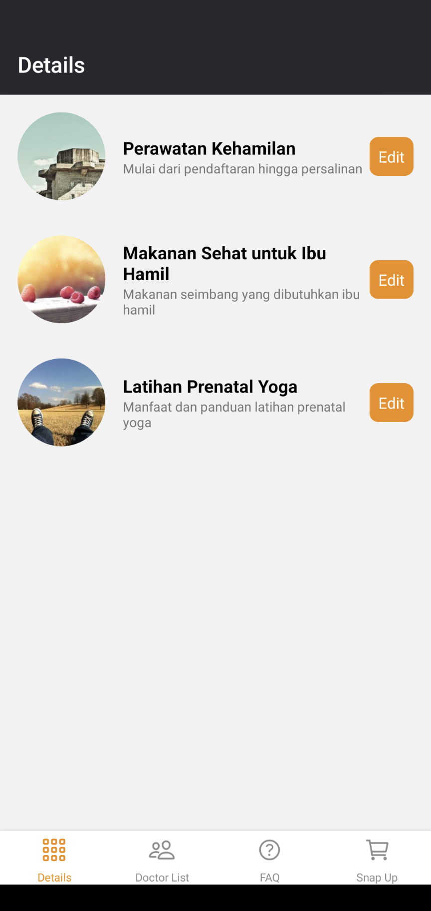

# PregBud

Aplikasi pembantu ibu hamil.

## Deskripsi

Aplikasi mobile ini menyediakan beberapa fitur terkait dengan kehamilan dan perawatan ibu hamil. Aplikasi ini dapat membantu ibu hamil untuk memperoleh informasi dan saran kesehatan yang tepat, serta dapat memudahkan dalam mencari dokter dan produk terkait kehamilan.

## Fitur

Berikut adalah beberapa fitur yang tersedia di aplikasi ini:
- Beranda: menampilkan informasi umum terkait kehamilan, seperti usia kehamilan, perkembangan janin, serta saran-saran untuk menjaga kesehatan ibu hamil.
- Dokter: daftar dokter spesialis kandungan yang tersedia, beserta informasi terkait spesialisasi dan lokasi praktek.
- FAQ: daftar pertanyaan yang sering ditanyakan terkait kehamilan, beserta jawaban-jawaban yang tepat.
- Snap Up: daftar produk terkait kehamilan, yang dapat dibeli secara online.

## Demo Aplikasi

## Installation

Berikut adalah langkah-langkah untuk menginstal project kamu:

1. Clone repository ini.
2. Buka terminal dan navigasi ke direktori project.
3. Jalankan perintah `npm install` atau `yarn install`.
4. Jalankan perintah `npm start` atau `yarn start`.

## Teknologi yang Digunakan

Berikut adalah teknologi yang digunakan dalam project ini:

- React Native
- Expo
- React Navigation

## Kontributor (Team 1)

- Imam Sutono
- Yehezkiel Setianto Putra
- Nurul Aulia Maysarah
- Yudhistira Bagas Bimantara
- Muhammad Farid Muslich